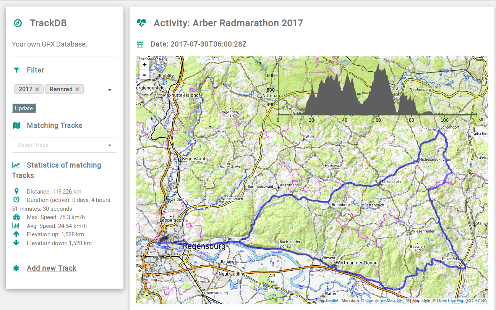

# Goal
Most mobile GPS devices, e.g. your Smartphone, Smartwatch, Sportwatch, GPS tracker or outdoor navigation device can record tracks in the [GPX](http://www.topografix.com/gpx.asp) format.

To keep track our these activities, there are quite a lot online services, for example [garmin connect](https://connect.garmin.com/en-US/), [endomondo](https://www.endomondo.com/) or [runkeeper](https://runkeeper.com/).

This project shall be an open-sourced, self-hosted and lightweight alternative to the commercial online services.


# Details
With this webservice, you can:
* browse existing tracks
* see overall statistics for all selected tracks
* display a map and detailed statistics
* add new tracks, delete old tracks, modify existing tracks
* download the raw GPX file of an existing track.

Filtering of tracks works with "tags". A track may have an arbitrary number of tags. A tag categorizes the track. It could be for example the year of the activity, the type of sport, the area where the track was recorded or something completely different. The categorization is up to the user.



Show the map of a track


Add a new track


# Installation
This chapter describes how to install the service on a computer with debian 9 Operating System and apache Webserver. The steps might be similar for other environments.


## Pre conditions
* Debian 9 installed
* Python 3 available


## Install required Software
Use your package manager to install required software. On debian, it is for example:
`sudo apt install python3-pip apache2 libapache2-mod-wsgi-py3`

If you want optional raw-access to the database, install a user interface to access the SQLite database:
`sudo apt install sqlitebrowser`

The services requires some python modules. Install them with pip3:
`pip3 install lxml flask peewee`

## Deploy the code
Go to your webserver directory `/var/www` and download the sources, either by running `git clone https://github.com/mjbayer/track-db.git` or by downloading manually the zipped sources from github. If latter, unzip the archive.


## Configure the Webserver
Create a new apache site configuration for trackdb. Add it to your available apache sites, by creating the following text file:

`/etc/apache2/sites-available/trackdb.conf`

The content of the file could look similar to the following template:
```
WSGIScriptAlias /trackdb /var/www/trackdb/flaskapp.wsgi

<Directory /var/www/trackdb/>
        Order allow,deny
        Allow from all
</Directory>
Alias /trackdb/static /var/www/trackdb/static
<Directory /var/www/trackdb/static/>
       Order allow,deny
       Allow from all
</Directory>
```
If you chose during "Deploy the code" above mentioned folder structure, you're done. Otherwise adapt the pathes accordingly.


Enable the apache wsgi module:
`sudo a2enmod wsgi`

And enable the site by running:
`sudo a2ensite trackdb.conf`

After a webserver reload, everything is ready!
`sudo systemctl reload apache2`

You can now reach trackdb from a browser with the url: http://hostname/trackdb


## Authentication
Trackdb does not support authentication out of the box yet.
But you can use your webservers' basic authentication feature.

Adapt the apache trackdb.conf, to include authentication. An example trackdb.conf file could look like this:
```
WSGIScriptAlias /trackdb /var/www/trackdb/flaskapp.wsgi

<Directory /var/www/trackdb/>
        AuthType Basic
        AuthName "Restricted"
        AuthBasicProvider file
        AuthUserFile /path/to/.htpasswd
        Require valid-user
        Order allow,deny
        Allow from all
</Directory>
Alias /trackdb/static /var/www/trackdb/static
<Directory /var/www/trackdb/static/>
       Order allow,deny
       Allow from all
</Directory>
```

In addition, you need an .htpassword file, that you can generate with the command htpassword. 
Check out `htpassword -h` for details.


# Development
This is my first web project ever. I had to learn most of the technologies from scratch. The project was started during a boring, bad-weather vacation. The code looks accordingly.

> Do not expect well designed architecture or clean code.
> But I'm happy to accept pull requests :-)


## Used technologies
As webframework, I use [Flask](http://flask.pocoo.org/) with [Jinja2](http://jinja.pocoo.org/) templating engine.
For storing and accessing metadata, I chose [peewee](http://docs.peewee-orm.com/en/latest/) object relational mapper, that uses a [sqlite](https://www.sqlite.org/) database.

The code parts for processing gpx files is designed as a library. If it is useful and works well, I consider refactoring this part to a separate python module later on. Before doing so, I have to make up my mind about a better API and write some unit tests. The gpx library part uses [lxml](https://lxml.de/).

The frontend uses HTML, CSS ([W3.css](http://https://www.w3schools.com/w3css)) and JS.
To select tags, I integrated [Semantic-UI](https://semantic-ui.com), which requires [JQuery](https://jquery.com/).
For showing the map, I use [leafletjs](https://leafletjs.com/) with the plugins [leaflet-gpx](https://github.com/mpetazzoni/leaflet-gpx) and [Leaflet.Elevation](https://github.com/MrMufflon/Leaflet.Elevation).

All artifacts (JS, fonts, CSS) are stored in this repository and can be delivered by a local webserver.


# FAQ
Database can not be created:
* make sure the user, that runs the webserver (e.g. www-data) has write access to trackdb (and all subfolders).

I just get the message "No suitable track found. Add Tracks or change Tag selection":
* You have to upload tracks. Use the "Add track" button.
* If you just did the inital installation and don't have any tracks at hand, you can use the demo tracks, that are included in the sources. Just unzip example-data.tar.gz. 
* If you use the filter, make sure a track matches your selected tags.

I run trackdb on an ARM device with apache + mod_wsgi. I get upload errors for gpx files >64KB:
* This is a funny issue. With my limited time I was not able to understand what's going on. If you have experience in debugging apache modules, feel free to help here out :) In the meantime: 
* Try running flask with gunicorn instead. You can directly start gunicorn with main.py: `gunicorn main` in the root folder of track-db. Besides that, you only need a reverse proxy (e.g. apache mod_proxy_http or nginx) and a script, that starts gunicorn on system startup. For more information, see http://docs.gunicorn.org/en/19.6.0/deploy.html
* If you want to access the application from a different url-path, configure the app object, as you can see in the uncommented line in app.py (`app.wsgi_app = ReverseProxied(app.wsgi_app, script_name="/trackdb-test")`). This is based on the description: http://blog.macuyiko.com/post/2016/fixing-flask-url_for-when-behind-mod_proxy.html


# TODO
* Put smoothing filter for GPX trackpoints in place
* Implement modify tags
* Code cleanup
* AJAX on tag selection
* Rework GPX library: API, Unit tests, refactor to separate python module
* Multi user support, login
